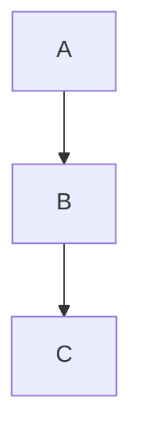

# Obsidian Flavored Markdown Reference

Reference for all OFM syntax used by Akasha agents when creating vault content.

## Frontmatter

```yaml
---
title: "Note Title"
type: concept         # concept, math, source, entity, question, moc
status: seed          # seed, growing, evergreen
domain: cs/math       # domain path
tags: [tag1, tag2]    # optional
aliases: [alt-name]   # optional
source: "url-or-book" # required for type: source
via: "person-or-url"  # optional, for claims
created: 2026-07-02   # YYYY-MM-DD
updated: 2026-07-02   # YYYY-MM-DD
---
```

Quote `title` and `description` values when they contain colons.

## Wikilinks

| Syntax | Result |
|--------|--------|
| `[[Note Name]]` | Link to note by title |
| `[[Note Name\|Display Text]]` | Link with custom display |
| `[[Note Name#Heading]]` | Link to heading within note |
| `[[Note Name#^block-id]]` | Link to block reference |
| `[[#heading]]` | Link to heading in same note |

## Embeds

| Syntax | Result |
|--------|--------|
| `![[Note Name]]` | Embed full note |
| `![[Note Name#Heading]]` | Embed section |
| `![[image.png]]` | Embed image |
| `![[image.png\|300]]` | Embed image at 300px width |
| `![[doc.pdf#page=3]]` | Embed PDF at page 3 |
| `![[audio.mp3]]` | Embed audio |
| `![[video.mp4]]` | Embed video |

## Callouts

```markdown
> [!note] Title
> Content here. Can be **markdown**.

> [!tip] Pro tip
> Helpful guidance.

> [!warning] Caution
> Something to be careful about.

> [!danger] Critical
> Serious issue.

> [!info]
> Info without a custom title.

> [!example]
> Illustrative example.

> [!quote]
> A quotation.

> [!success]
> Achievement or success.

> [!failure]
> Something that failed.

> [!bug]
> Known bug.

> [!question]
> Open question.

> [!abstract]
> Summary or abstract.

> [!todo]
> Action item or todo.
```

Foldable variants: `> [!note]-` (collapsed), `> [!note]+` (expanded).
Callouts can be nested by indenting the inner callout.

## Tags

```yaml
---
tags: [linear-algebra, eigenvalues, math]
---
```

Inline: `#tag-name` (adds to Obsidian tag pane).

## Comments and Highlights

- `%%text%%` — Hidden comment (visible in editor only)
- `==text==` — Highlighted text

## Math

- Inline: `$E = mc^2$`
- Block: `$$ \int_a^b f(x)\,dx $$`
- LaTeX commands: `\sum`, `\prod`, `\sqrt`, `\frac`, `\alpha`, `\beta`, etc.

## Footnotes

```markdown
Here's a statement with a footnote[^1].

[^1]: The footnote definition with details.
```

## Mermaid Diagrams



Refer to the diagram parser skill for specific diagram types (flowchart, sequence, class, etc.).

## Never

- Use `#` for headings with missing space after `#` — markdown parsers reject `#Heading`
- Mix frontmatter delimiters — use `---` not `+++` or `;;;`
- Leave empty frontmatter fields with no value
- Use bare URLs instead of wikilinks for internal references
