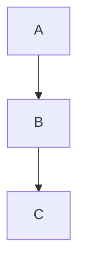

# Reference Adaptation Implementation Plan

> **For agentic workers:** REQUIRED SUB-SKILL: Use superpowers:subagent-driven-development (recommended) or superpowers:executing-plans to implement this plan task-by-task. Steps use checkbox (`- [ ]`) syntax for tracking.

**Goal:** Adapt defuddle, OFM reference, lint upgrade, hot cache protocol, session-init hook, review smart router, forward monthly planning, and skill-discovery hook from three reference repos into Akasha's existing infrastructure.

**Architecture:** Three independent packages, no cross-dependencies. Package A (ingest quality) modifies ingest agent and creates two reference files. Package B (health/session) modifies lint agent, daily agent, AGENTS.md, and adds a SessionStart hook. Package C (review/UX) creates a review skill, modifies recap agent, and adds a Stop event hook for skill discovery.

**Tech Stack:** Bash (Git Bash on Windows), Command Code hooks/skills/agents (YAML frontmatter + markdown prompts)

---

## Files Changed

| File | Action | Package |
|------|--------|---------|
| `.commandcode/skills/akasha-defuddle/SKILL.md` | Create | A |
| `.commandcode/references/obsidian-flavored-markdown.md` | Create | A |
| `.commandcode/agents/akasha-ingest.md` | Edit | A |
| `AGENTS.md` | Edit | A, B |
| `.commandcode/agents/akasha-lint.md` | Edit | B |
| `.commandcode/agents/akasha-daily.md` | Edit | B |
| `.commandcode/hooks/SessionStart.sh` | Create | B |
| `.commandcode/settings.json` | Edit | B, C |
| `.commandcode/skills/akasha-review/SKILL.md` | Create | C |
| `.commandcode/agents/akasha-recap.md` | Edit | C |
| `.commandcode/hooks/Stop.sh` | Create | C |

---

### Task 1: Create defuddle skill

**Files:**
- Create: `.commandcode/skills/akasha-defuddle/SKILL.md`

- [ ] **Step 1: Write the SKILL.md file**

Create `.commandcode/skills/akasha-defuddle/SKILL.md` with this content:

```markdown
# Defuddle — Web Page to Clean Markdown

A utility skill for the Akasha ingest pipeline. Converts web page URLs to clean, readable markdown by stripping navigation, ads, and clutter.

## When to use

Invoke this skill when the ingest pipeline encounters a URL as source material. Do NOT use for `.md` files, PDFs, or other direct document URLs — those use `web_fetch` or `akasha-material-parser` directly.

## Workflow

1. **Try defuddle** — Run `npx defuddle parse <url> --md`. npx auto-downloads and caches the package; no global install needed.
2. **On success** — Pipe the markdown output back to the calling agent for processing.
3. **On failure** — If defuddle errors (network error, empty output, or non-page URL), fall back to `web_fetch <url>` directly.

## Flags reference

| Flag | Purpose |
|------|---------|
| `--md` | Output as markdown (default when -o omitted) |
| `--json` | Output structured JSON (title, description, content, byline, siteName, domain) |
| `-o file.md` | Write to file instead of stdout |
| `-p title` | Extract specific metadata field only |

## Examples

```bash
# Write to stdout as markdown
npx defuddle parse https://example.com/article --md

# Save to file
npx defuddle parse https://example.com/article -o /tmp/article.md

# Get structured JSON
npx defuddle parse https://example.com/article --json
```

## Note

Defuddle handles most blog posts, documentation pages, and news articles. It may struggle with JavaScript-heavy SPAs or login-walled pages — fall back to `web_fetch` in those cases.
```

- [ ] **Step 2: Commit**

```bash
git add .commandcode/skills/akasha-defuddle/SKILL.md
git commit -m "feat: add defuddle skill for web-to-markdown ingest"
```

---

### Task 2: Create Obsidian Flavored Markdown reference

**Files:**
- Create: `.commandcode/references/obsidian-flavored-markdown.md`

- [ ] **Step 1: Write the reference document**

Create `.commandcode/references/obsidian-flavored-markdown.md`:

```markdown
# Obsidian Flavored Markdown Reference

Reference for all OFM syntax used by Akasha agents when creating vault content.

## Frontmatter

```yaml
---
title: "Note Title"
type: concept         # concept, math, source, entity, question, moc
status: seed          # seed, growing, evergreen
domain: cs/math       # domain path
tags: [tag1, tag2]    # optional
aliases: [alt-name]   # optional
source: "url-or-book" # required for type: source
via: "person-or-url"  # optional, for claims
created: 2026-07-02   # YYYY-MM-DD
updated: 2026-07-02   # YYYY-MM-DD
---
```

Quote `title` and `description` values when they contain colons.

## Wikilinks

| Syntax | Result |
|--------|--------|
| `[[Note Name]]` | Link to note by title |
| `[[Note Name|Display Text]]` | Link with custom display |
| `[[Note Name#Heading]]` | Link to heading within note |
| `[[Note Name#^block-id]]` | Link to block reference |
| `[[#heading]]` | Link to heading in same note |

## Embeds

| Syntax | Result |
|--------|--------|
| `![[Note Name]]` | Embed full note |
| `![[Note Name#Heading]]` | Embed section |
| `![[image.png]]` | Embed image |
| `![[image.png|300]]` | Embed image at 300px width |
| `![[doc.pdf#page=3]]` | Embed PDF at page 3 |
| `![[audio.mp3]]` | Embed audio |
| `![[video.mp4]]` | Embed video |

## Callouts

```markdown
> [!note] Title
> Content here. Can be **markdown**.

> [!tip] Pro tip
> Helpful guidance.

> [!warning] Caution
> Something to be careful about.

> [!danger] Critical
> Serious issue.

> [!info]
> Info without a custom title.

> [!example]
> Illustrative example.

> [!quote]
> A quotation.

> [!success]
> Achievement or success.

> [!failure]
> Something that failed.

> [!bug]
> Known bug.

> [!question]
> Open question.

> [!abstract]
> Summary or abstract.

> [!todo]
> Action item or todo.
```

Foldable variants: `> [!note]-` (collapsed), `> [!note]+` (expanded).
Callouts can be nested by indenting the inner callout.

## Tags

```yaml
---
tags: [linear-algebra, eigenvalues, math]
---
```

Inline: `#tag-name` (adds to Obsidian tag pane).

## Comments and Highlights

- `%%text%%` — Hidden comment (visible in editor only)
- `==text==` — Highlighted text

## Math

- Inline: `$E = mc^2$`
- Block: `$$ \int_a^b f(x)\,dx $$`
- LaTeX commands: `\sum`, `\prod`, `\sqrt`, `\frac`, `\alpha`, `\beta`, etc.

## Footnotes

```markdown
Here's a statement with a footnote[^1].

[^1]: The footnote definition with details.
```

## Mermaid Diagrams

````markdown

````

Refer to the diagram parser skill for specific diagram types (flowchart, sequence, class, etc.).

## Never

- Use `#` for headings with missing space after `#` — markdown parsers reject `#Heading`
- Mix frontmatter delimiters — use `---` not `+++` or `;;;`
- Leave empty frontmatter fields with no value
- Use bare URLs instead of wikilinks for internal references
```

- [ ] **Step 2: Commit**

```bash
git add .commandcode/references/obsidian-flavored-markdown.md
git commit -m "docs: add Obsidian Flavored Markdown reference doc"
```

---

### Task 3: Wire defuddle and OFM reference into ingest agent and AGENTS.md

**Files:**
- Modify: `.commandcode/agents/akasha-ingest.md`
- Modify: `AGENTS.md`

- [ ] **Step 1: Add defuddle behavior to akasha-ingest agent**

In `.commandcode/agents/akasha-ingest.md`, find the description/behavior section. After the "Process one Inbox item" description, add a new instruction paragraph:

```
When processing a URL source, first invoke `akasha-defuddle` to get clean markdown before any further processing. Fall back to direct `web_fetch` if defuddle fails.
```

If the agent prompt has a Process section, add as a step there instead.

- [ ] **Step 2: Add OFM production instruction to AGENTS.md**

In `AGENTS.md`, after the existing methodology section, add:

```
### Output Quality

All agents produce valid Obsidian Flavored Markdown. Reference `.commandcode/references/obsidian-flavored-markdown.md` for exact syntax: wikilinks, embeds, callouts, frontmatter, tags, comments, highlights, math, footnotes, and Mermaid.
```

- [ ] **Step 3: Add hot cache protocol to AGENTS.md startup**

In `AGENTS.md`, replace the existing `## Startup` section content with:

```
## Startup

At the start of any session, silently read context in this order, respecting token budgets:

1. **`.akasha/hot.md`** — ≤500 tokens. Establishes active context (streak, goals, yesterday's carry-over, today's ONE Big Thing, inbox count).
2. **`Knowledge/_domains.md`** — ≤1000 tokens. Establishes the domain landscape and which Knowledge areas exist.
3. **3-5 specific pages** relevant to today's work — ≤300 tokens each.

Total pre-work: ≤3000 tokens before executing any user request.
```

- [ ] **Step 4: Commit**

```bash
git add .commandcode/agents/akasha-ingest.md AGENTS.md
git commit -m "feat: wire defuddle and OFM into ingest/AGENTS, add hot cache protocol"
```

---

### Task 4: Upgrade akasha-lint with structured report and stale claim detection

**Files:**
- Modify: `.commandcode/agents/akasha-lint.md`

- [ ] **Step 1: Update frontmatter description**

The `description:` field should remain quoted (already fixed from the YAML bug). No changes needed to frontmatter.

- [ ] **Step 2: Add stale claim detection section to the agent prompt**

After the existing section 7 (Registry drift) in the agent prompt, add:

```
## 8. Unbacked claims (no source/via)

For each note with `type: concept` or `type: question`, check whether the file body contains factual assertions (sentences outside of Connections/References sections) that have no `source:` or `via:` frontmatter field. If the frontmatter has neither field, flag the note as potentially unbacked.

| Note | Domain | Missing |
|------|--------|---------|
| ... | ... | source and via |
-> No issues
```

- [ ] **Step 3: Add summary banner to report output**

In the Process section, add a new step 8 (renumber existing step 8 to 9):

```
8. After all sections are scanned, compute a summary banner. Count how many sections have at least one issue and total issue count.

Produce at the top of every report:
```markdown
## Summary: X issues across Y categories
```
```

- [ ] **Step 4: Update stale seed section to show age in days**

Find the "## 5. Stale seed notes" section in the report format. Update the table to include an age column:

```
## 5. Stale seed notes (>30 days)
| Note | Domain | Age (days) |
|------|--------|------------|
| ... | ... | ... |
-> No issues
```

In the Process section, update step 3's stale seed handling to compute age: parse the `created` frontmatter field, compute `now - created` in days, and show only entries where age > 30.

- [ ] **Step 5: Commit**

```bash
git add .commandcode/agents/akasha-lint.md
git commit -m "feat: upgrade lint with structured report, stale claims, age column"
```

---

### Task 5: Tighten akasha-daily hot.md writer

**Files:**
- Modify: `.commandcode/agents/akasha-daily.md`

- [ ] **Step 1: Add hot.md writer instructions**

In `.commandcode/agents/akasha-daily.md`, find the section where the agent writes `.akasha/hot.md`. Add or replace with:

```
### Hot cache update

After scaffolding today's daily note, write `.akasha/hot.md` with ONLY these fields (keep under 500 tokens):
- Active streak (from `.akasha/streak.md`)
- Current goals cascade summary (from `Goals/` files at all levels)
- Yesterday's top-3 deliverables and one-line reflection
- Current inbox count (files in `Inbox/` excluding `_processed/`)
- ONE Big Thing for today

Do NOT include: full session logs, file listings, raw command output, or any content longer than 500 tokens total.
```

- [ ] **Step 2: Commit**

```bash
git add .commandcode/agents/akasha-daily.md
git commit -m "feat: tighten hot.md writer to 500-token budget"
```

---

### Task 6: Create SessionStart hook

**Files:**
- Create: `.commandcode/hooks/SessionStart.sh`
- Modify: `.commandcode/settings.json`

- [ ] **Step 1: Write the SessionStart.sh script**

Create `.commandcode/hooks/SessionStart.sh`:

```bash
#!/usr/bin/env bash
# SessionStart hook — Akasha session context injection
# Injects: date, daily status, weekly freshness, streak, inbox, active materials
# Runs on session start (advisory, non-blocking)

set -euo pipefail

VAULT="$HOME/Documents/Gio Files/AKASHA/akasha-pkm-ref"

# Today's date
DATE=$(date '+%Y-%m-%d')
DAY=$(date '+%A')

# Check daily note
DAILY_FILE="$VAULT/Daily/$DATE.md"
if [ -f "$DAILY_FILE" ]; then
  DAILY_STATUS="✅ today's note exists"
else
  DAILY_STATUS="❌ no daily note yet"
fi

# Days since last weekly review — use file mtime for reliability
LAST_WEEKLY=$(ls -1t "$VAULT/Reviews/"*.md 2>/dev/null | head -1)
if [ -n "$LAST_WEEKLY" ]; then
  FILE_MTIME=$(stat -c %Y "$LAST_WEEKLY" 2>/dev/null || date -r "$LAST_WEEKLY" +%s 2>/dev/null || echo 0)
  NOW=$(date +%s)
  DIFF=$(( (NOW - FILE_MTIME) / 86400 ))
  [ "$DIFF" -lt 0 ] && DIFF=0
  WEEKLY_AGE="$DIFF days since last weekly"
else
  WEEKLY_AGE="no weekly review yet"
fi

# Streak
STREAK_FILE="$VAULT/.akasha/streak.md"
if [ -f "$STREAK_FILE" ]; then
  STREAK_LEN=$(grep -c "✅" "$STREAK_FILE" 2>/dev/null || echo "?")
  STUDY=$(grep -c "study: ✅" "$STREAK_FILE" 2>/dev/null && echo "✅" || echo "❌")
  MOVE=$(grep -c "move: ✅" "$STREAK_FILE" 2>/dev/null && echo "✅" || echo "❌")
  CONSUME=$(grep -c "consume: ✅" "$STREAK_FILE" 2>/dev/null && echo "✅" || echo "❌")
  STREAK="Streak: $STREAK_LEN days (study $STUDY move $MOVE consume $CONSUME)"
else
  STREAK="Streak: not initialized"
fi

# Inbox count
INBOX_COUNT=$(find "$VAULT/Inbox" -maxdepth 1 -name '*.md' 2>/dev/null | wc -l)
INBOX="Inbox: $INBOX_COUNT pending"

# Active materials (max 3)
MATERIALS=$(ls -1 "$VAULT/StudyMaterials/active/"*.md 2>/dev/null | head -3 | while read f; do
  echo "  - $(basename "$f" .md)"
done)

# Output context block
echo "# Session Context — $DATE ($DAY)"
echo "$DAILY_STATUS"
echo "$WEEKLY_AGE"
echo "$STREAK"
echo "$INBOX"
if [ -n "$MATERIALS" ]; then
  echo "Active materials:"
  echo "$MATERIALS"
fi
echo ""
```

- [ ] **Step 2: Register in settings.json**

In `.commandcode/settings.json`, add a `SessionStart` hook entry. The current settings have:

```json
{
  "hooks": {
    "PreToolUse": [...],
    "PostToolUse": [...]
  }
}
```

Add `SessionStart`:

```json
{
  "hooks": {
    "PreToolUse": [...],
    "PostToolUse": [...],
    "SessionStart": [
      {
        "hooks": [
          {
            "type": "command",
            "command": "bash .commandcode/hooks/SessionStart.sh",
            "timeout": 5
          }
        ]
      }
    ]
  }
}
```

- [ ] **Step 3: Make the hook executable (if needed on Windows/Git Bash)**

```bash
chmod +x .commandcode/hooks/SessionStart.sh
```

- [ ] **Step 4: Commit**

```bash
git add .commandcode/hooks/SessionStart.sh .commandcode/settings.json
git commit -m "feat: add SessionStart hook for session context injection"
```

---

### Task 7: Create review smart router skill

**Files:**
- Create: `.commandcode/skills/akasha-review/SKILL.md`

- [ ] **Step 1: Write the SKILL.md file**

Create `.commandcode/skills/akasha-review/SKILL.md`:

```markdown
# Akasha Review — Smart Router

Routes the user to the right review experience based on the current date and time. Single entry point — remembers no command names needed.

## When to use

User types `/akasha-review`. Determine current day, time, and vault state to dispatch.

## Routing logic

1. **Get current date and time** — Read `date` command output.
2. **Detect end of month** — If current date is within 3 days of month end, route to monthly recap.
3. **Detect weekend** — If Friday (after 18:00), Saturday, or Sunday, route to weekly review.
4. **Detect time of day** — Before 12:00 is morning scaffold, after 18:00 is evening reflection.
5. **Check existing state** — If dispatch target has already been run today/this week, ask before re-running.

| Condition | Route | Target |
|-----------|-------|--------|
| Last 3 days of month (any time) | Monthly recap | `akasha-recap monthly` |
| Fri 18:00+ / Sat / Sun | Weekly review | `akasha-weekly` |
| Before 12:00 (weekday) | Morning scaffold | `akasha-daily` |
| After 18:00 (weekday) | Evening reflection | `akasha-daily` (reflection pass) |
| 12:00–18:00 (weekday) | Suggest: "Midday check. Run `/akasha-daily` for updates or wait for evening reflection?" | Informational |

## Edge cases

- **Month-end + weekend overlap**: Monthly recap takes priority. Weekly can be postponed.
- **No daily note yet**: Morning route creates one. Evening route prompts: "No daily note for today. Run morning scaffold first?"
- **Already reviewed this week**: Check if `Reviews/YYYY-WXX.md` exists for current week. If yes, ask.
- **Already recapped this month**: Check if `Recaps/monthly/YYYY-MM.md` exists. If yes, ask.
- **First-time user**: If no daily/weekly/recap files exist, default to morning daily scaffold with setup guidance.

## Output

Brief confirmation of what was dispatched. Example:

```
→ Friday evening — routing to weekly review.
Running /akasha-weekly...
```
```

- [ ] **Step 2: Commit**

```bash
git add .commandcode/skills/akasha-review/SKILL.md
git commit -m "feat: add review smart router skill"
```

---

### Task 8: Add forward monthly planning to akasha-recap

**Files:**
- Modify: `.commandcode/agents/akasha-recap.md`

- [ ] **Step 1: Add forward planning instructions to the agent prompt**

In `.commandcode/agents/akasha-recap.md`, after the existing process for producing the backward-looking recap, add:

```
### Forward planning pass (monthly only)

After the recap is confirmed by the user, do the following for monthly recaps only:

1. **Read the current month's goals** — Check `Goals/monthly/` for `YYYY-MM.md` matching the recap period. If found, read Must/Should/Nice.
2. **Cross-reference** — Compare each deliverable against the recap scratch data and dailies. Identify: completed, partially done, slipped (not started or unfinished), or over-performed (did more than planned).
3. **Propose next month** — Present the user with proposed Must/Should/Nice for next month:
   - Slipped deliverables from this month → carry forward to next month's Must
   - Completed deliverables → archive
   - Any semester-level goals that need attention → propose new deliverables
   - Format: "Proposed next month — Must: [X], Should: [Y], Nice: [Z]. Accept or tweak?"
4. **User confirms** — User accepts as-is, tweaks via conversation, or rejects.
5. **Write goals file** — If user confirms (as-is or tweaked), write `Goals/monthly/YYYY-MM.md`:

```yaml
---
type: monthly
period: YYYY-MM
parent: semester/YYYY-target.md
---

# Month — YYYY-MM

## Must
- [ ] Deliverable

## Should
- [ ] Deliverable

## Nice
- [ ] Deliverable
```

6. **No goals exist** — If no monthly goals file exists, propose from scratch based on semester/yearly goals: "No monthly goals on file. Based on your semester goals, here's a suggested start — [proposal]. Accept or tweak?"

For weekly recaps: skip the forward planning pass entirely.
For semester recaps: skip the forward planning pass (semester planning is handled by `/akasha-goal-set`).
```

- [ ] **Step 2: Commit**

```bash
git add .commandcode/agents/akasha-recap.md
git commit -m "feat: add forward monthly planning to recap agent"
```

---

### Task 9: Create Stop event hook for skill discovery

**Files:**
- Create: `.commandcode/hooks/Stop.sh`
- Modify: `.commandcode/settings.json`

- [ ] **Step 1: Write the Stop.sh script**

Create `.commandcode/hooks/Stop.sh`:

```bash
#!/usr/bin/env bash
# Stop event hook — skill discovery
# When user asks "help", "skills", "what can you do", "commands", or "available",
# inject a listing of all /akasha-* commands.
# Anti-spam: only triggers once per 3 turns (tracked via cache file).
set -euo pipefail

CACHE="$HOME/.commandcode/.skill-discovery-cache"
TURN_FILE="$HOME/.commandcode/.turn-counter"

# Read stdin payload
payload=$(cat)

# Auto-increment turn counter (Stop hook fires every turn)
TURN_FILE="$HOME/.commandcode/.turn-counter"
TURN=0
[ -f "$TURN_FILE" ] && TURN=$(cat "$TURN_FILE" 2>/dev/null || echo 0)
TURN=$((TURN + 1))
echo "$TURN" > "$TURN_FILE"

# Extract user message text using Node.js (portable JSON parsing)
user_msg=$(echo "$payload" | node -e "
  process.stdin.on('data', d => {
    try {
      const p = JSON.parse(d);
      // Try to find the user's last message
      const msgs = p.messages || [];
      const last = msgs.filter(m => m.role === 'user').pop();
      console.log(last?.content?.[0]?.text || last?.content || '');
    } catch(e) {
      console.log('');
    }
  });
")

# Normalize to lowercase for matching
lower_msg=$(echo "$user_msg" | tr '[:upper:]' '[:lower:]')

# Check for trigger keywords — strict list only
triggered=0
for kw in "help" "skills" "what can you do" "commands" "available"; do
  case "$lower_msg" in
    *"$kw"*) triggered=1; break ;;
  esac
done

# No trigger — output empty JSON (no action)
[ "$triggered" -eq 0 ] && echo '{}' && exit 0

# Anti-spam: read last trigger turn
LAST_TRIGGER=0
[ -f "$CACHE" ] && LAST_TRIGGER=$(cat "$CACHE" 2>/dev/null || echo 0)

# Only trigger if 3+ turns have passed since last trigger
GAP=$((TURN - LAST_TRIGGER))
if [ "$GAP" -lt 3 ]; then
  echo '{}'
  exit 0
fi

# Update cache
echo "$TURN" > "$CACHE"

# Inject system message with skill listing
node -e "
  console.log(JSON.stringify({
    systemMessage: 'Available Akasha commands:\n\n' +
      '  /akaska-review    — Smart router: daily/weekly/monthly review\n' +
      '  /akasha-ingest    — Process one inbox item\n' +
      '  /akasha-lint      — Vault hygiene report (read-only)\n' +
      '  /akasha-query     — Search or status dashboard\n' +
      '  /akasha-daily     — Scaffold today\\'s daily note\n' +
      '  /akasha-weekly    — Weekly review ritual\n' +
      '  /akasha-recap     — Period recap (weekly/monthly/semester)\n' +
      '  /akasha-capture   — Quick seed note creation\n' +
      '  /akasha-goal-set  — Create goals at any cascade level\n' +
      '  /akasha-goal-check— Audit goals vs recent activity\n' +
      '  /akasha-search    — Search knowledge base\n' +
      '  /akasha-adopt     — Migrate existing vault into Akasha\\n\\n' +
      'Tip: type /akasha-<command> to run one.'
  }));
"
```

- [ ] **Step 2: Register in settings.json**

Update `.commandcode/settings.json`. The current structure has hooks for PreToolUse, PostToolUse, and SessionStart (from Task 6). Add the Stop event:

```json
{
  "hooks": {
    "PreToolUse": [...],
    "PostToolUse": [...],
    "SessionStart": [...],
    "Stop": [
      {
        "hooks": [
          {
            "type": "command",
            "command": "bash .commandcode/hooks/Stop.sh",
            "timeout": 5
          }
        ]
      }
    ]
  }
}
```

- [ ] **Step 3: Make the hook executable**

```bash
chmod +x .commandcode/hooks/Stop.sh
```

- [ ] **Step 4: Commit**

```bash
git add .commandcode/hooks/Stop.sh .commandcode/settings.json
git commit -m "feat: add Stop hook for skill discovery"
```

---

### Task 10: Spec self-review and verify

- [ ] **Step 1: Verify all files are tracked**

```bash
git status
```

Expected: all created and modified files are listed. No untracked files that should be added.

- [ ] **Step 2: Verify hook scripts are syntactically valid**

```bash
bash -n .commandcode/hooks/SessionStart.sh
bash -n .commandcode/hooks/Stop.sh
```

Expected: no syntax errors.

- [ ] **Step 3: Verify YAML frontmatter in all agent files**

Check no colons in unquoted `description` fields by reading the first 5 lines of each agent file and ensuring `description:` values are quoted where they contain `: `.

```bash
head -5 .commandcode/agents/akasha-lint.md .commandcode/agents/akasha-query.md
```

Expected: both `description:` values wrapped in double quotes.

- [ ] **Step 4: Final commit if any fixes were needed**

```bash
git add -A
git commit -m "chore: spec review fixes"
```

---

## Self-Review Checklist

**Spec coverage:**
- [x] A1 (defuddle skill) → Task 1
- [x] A2 (OFM reference) → Task 2
- [x] A1/A2 agent wiring → Task 3
- [x] B1 (lint upgrade) → Task 4
- [x] B2 (hot cache) → Task 3 (step 3) + Task 5
- [x] B3 (session-init hook) → Task 6
- [x] C1 (review router) → Task 7
- [x] C2 (forward monthly planning) → Task 8
- [x] C3 (skill-discovery hook) → Task 9
- [x] Verification → Task 10

**Placeholder scan:** No TBD, TODO, or vague requirements. Every step has complete code or exact instructions.

**Type consistency:** No cross-task type references. Each task is self-contained.

**Execution handoff ready:** All tasks are bite-sized (2-5 min each), have exact file paths, complete code blocks, and exact git commands.
